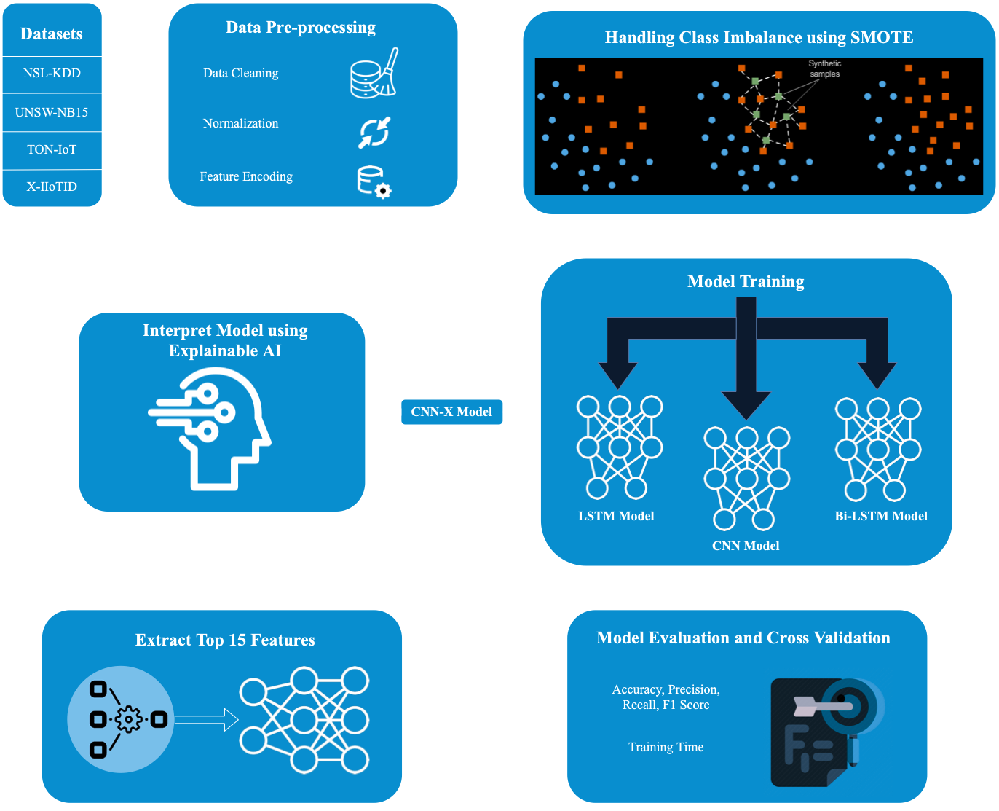
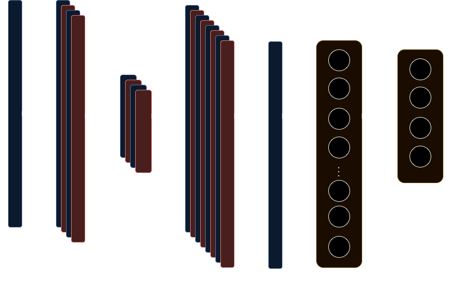

# CNN-X: Explaining Multi-Class Deep Learning Intrusion Detection Systems for Internet of Things

## Overview

This repository contains the implementation of a **Explainable AI (XAI) based Long Short-Term Memory (LSTM) model for Intrusion Detection in Internet of Things (IoT)** environments. This research proposes multiple deep learning models trained on diverse intrusion detection datasets and applies SHAP (Shapley Additive Explanations) for explainability. By combining deep learning and XAI, this project aims to enhance the transparency and trustworthiness of Intrusion Detection Systems (IDS) used in IoT networks.

## Key Features
- **Explainable AI (XAI)**: Use of SHAP for feature importance and model explanation.
- **Deep Learning Models**: LSTM, CNN, and Bi-LSTM models for multiclass classification of network intrusions.
- **Datasets**: Includes models trained on NSL-KDD, UNSW-NB15, TON-IoT, and X-IIoTID datasets.
- **Feature Selection**: Top 15 features are selected using SHAP for efficient training and prediction.

## Model Performance
The CNN-X model demonstrated high accuracy for multi-class classification on all datasets:
- **NSL-KDD**: 98.21% Accuracy
- **UNSW-NB15**: 82.1% Accuracy
- **TON-IoT**: 97.8% Accuracy
- **X-IIoTID**: 98.09% Accuracy

## Datasets
The following datasets were used to train and evaluate the IDS:

1. **NSL-KDD**  
   A refined version of the KDD-CUP99 dataset for traditional network attacks.  
   - **Classes**: Normal, Attack (23 sub-types)
   - **Features**: 41

2. **UNSW-NB15**  
   A modern network dataset for evaluating IDS models, containing a mix of real and synthetic attack behaviors.  
   - **Classes**: Normal, Attack (9 sub-types)
   - **Features**: 47

3. **TON-IoT**  
   A large-scale IIoT dataset with telemetry data for IoT devices, focusing on cyberattacks in IIoT environments.  
   - **Classes**: Normal, Attack (9 sub-types)
   - **Features**: 43

4. **X-IIoTID**  
   A next-generation IIoT dataset capturing various modern attack types and scenarios.  
   - **Classes**: Normal, Attack (17 sub-types)
   - **Features**: 67

## Framework Architecture
The framework architecture consists of several key stages, starting from data preprocessing, followed by training the deep learning models for intrusion detection, and finally interpreting the results using SHAP for explainability.

### Components:
1. **Data Preprocessing**: This stage involves cleaning the data, handling missing values, and feature scaling. Class imabalance in ToN-IoT and UNSW-NB15 is addressed using SMOTE.
2. **Model Training**: Deep learning models (CNN, LSTM, and Bi-LSTM) are trained on the preprocessed datasets.
3. **Explainability**: SHAP is used to explain the predictions and identify key features that influence the model's decision.

### Architecture Diagram:

## Model Architecture
The architecture of the models used in this project includes:
- **CNN**: A convolutional neural network for extracting spatial features from the datasets.
- **LSTM**: A Long Short-Term Memory network for capturing temporal dependencies in the data.
- **Bi-LSTM**: A bidirectional LSTM for considering both past and future temporal information.

### CNN Model Architecture

The following table lists the layers used in the CNN-X model for intrusion detection:

| Layer (Type)        | Output Shape      | Parameters |
|---------------------|-------------------|------------|
| **Conv1D (Layer 1)**| (None, 118, 64)   | 256        |
| **Conv1D (Layer 2)**| (None, 116, 64)   | 12,352     |
| **MaxPooling1D**    | (None, 58, 64)    | 0          |
| **Conv1D (Layer 3)**| (None, 56, 128)   | 24,704     |
| **Conv1D (Layer 4)**| (None, 54, 128)   | 49,280     |
| **MaxPooling1D**    | (None, 27, 128)   | 0          |
| **Flatten**         | (None, 3456)      | 0          |
| **Dense (Layer 1)** | (None, 128)       | 442,496    |
| **Dropout**         | (None, 128)       | 0          |
| **Dense (Output)**  | (None, 5)         | 645        |

### CNN Architecture Diagram:

## Results
## Performance Results for All Models Using Complete Feature Set

| Dataset      | Model    | Accuracy | Precision | Recall  | F1-Score | Training Time (s) |
|--------------|----------|----------|-----------|---------|----------|-------------------------|
| **NSL-KDD**  | CNN      | 99.68%   | 99.37%    | 99.41%  | 99.37%   | 218                     |
|              | LSTM     | 98.70%   | 98.51%    | 98.70%  | 98.54%   | 290                     |
|              | Bi-LSTM  | 99.11%   | 99.25%    | 99.14%  | 99.12%   | 325                     |
| **UNSW-NB15**| CNN      | 85.07%   | 85.80%    | 84.12%  | 84.91%   | 2145                    |
|              | LSTM     | 85.80%   | 87.00%    | 84.80%  | 85.90%   | 2265                    |
|              | Bi-LSTM  | 86.00%   | 88.10%    | 85.50%  | 86.20%   | 2400                    |
| **TON-IoT**  | CNN      | 97.73%   | 97.91%    | 97.67%  | 97.72%   | 37,486                  |
|              | LSTM     | 96.80%   | 97.00%    | 96.70%  | 96.80%   | 39,200                  |
|              | Bi-LSTM  | 98.13%   | 98.30%    | 98.00%  | 98.10%   | 41,000                  |
| **X-IIoTID** | CNN      | 98.09%   | 98.14%    | 97.83%  | 97.98%   | 2,633                   |
|              | LSTM     | 97.70%   | 97.90%    | 97.60%  | 97.70%   | 2,720                   |
|              | Bi-LSTM  | 97.91%   | 98.00%    | 97.80%  | 97.90%   | 2,840                   |

### Results for Models Using Reduced Feature Set

| Dataset      | Model    | Accuracy | Precision | Recall  | F1-Score | Training Time (s) |
|--------------|----------|----------|-----------|---------|----------|-------------------------|
| **NSL-KDD**  | CNN-X    | 98.21%   | 98.37%    | 98.41%  | 98.14%   | 175                     |
| **UNSW-NB15**| CNN-X    | 82.10%   | 85.81%    | 83.22%  | 83.22%   | 425                     |
| **TON-IoT**  | CNN-X    | 97.80%   | 97.91%    | 97.67%  | 97.72%   | 3,794                   |
| **X-IIoTID** | CNN-X    | 98.09%   | 98.14%    | 97.83%  | 97.98%   | 457                     |

### Summary of Training Time Comparison

| Dataset      | Complete Model Time (seconds) | Reduced Model Time (seconds) |
|--------------|-------------------------------|------------------------------|
| **NSL-KDD**  | 218                           | 175                          |
| **UNSW-NB15**| 2145                          | 425                          |
| **TON-IoT**  | 37,486                        | 3,794                        |
| **X-IIoTID** | 2,633                         | 457                          |
